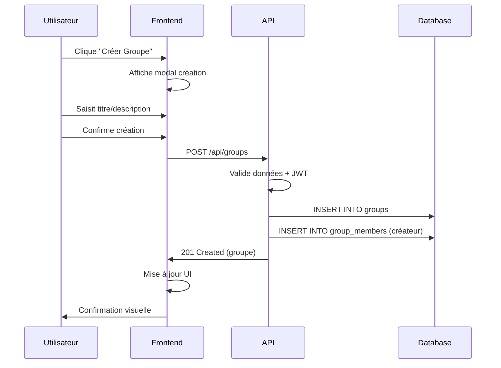
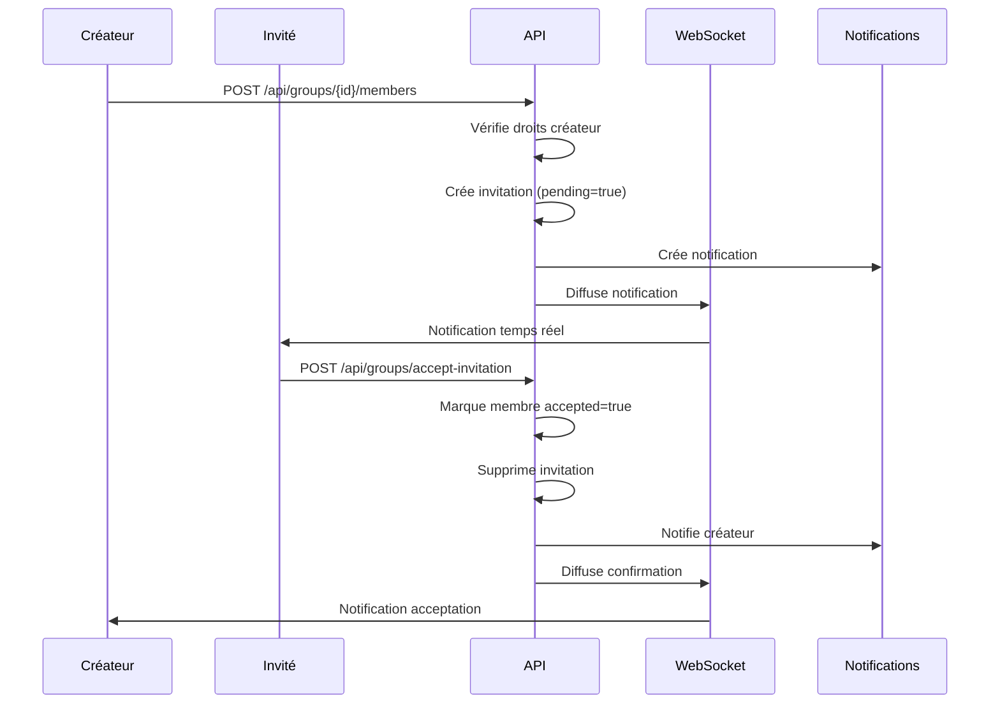
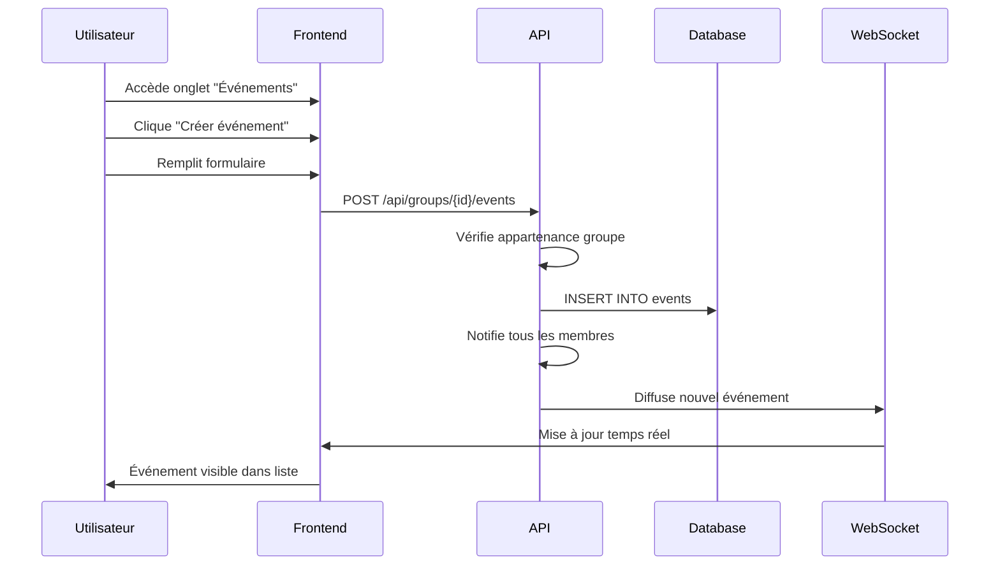
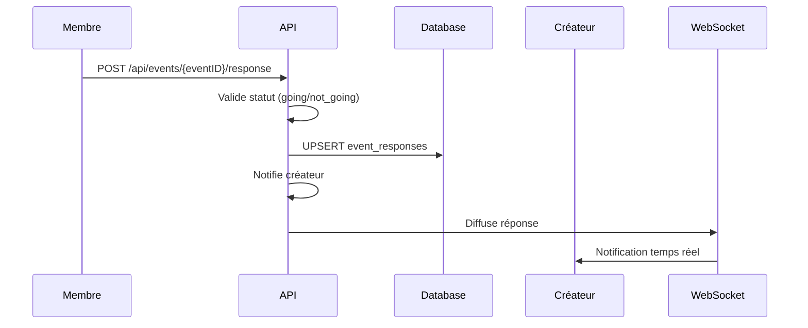

# Analyse Complète du Système de Création de Groupes et d'Événements

## 📋 Synthèse Exécutive

Ce document présente une analyse complète et systémique du système de création de groupes et d'événements dans l'application de réseau social. L'analyse couvre tous les aspects architecturaux, de la base de données au frontend, en passant par l'API REST et les WebSockets, avec une évaluation des flux utilisateur et des recommandations d'amélioration.

**Verdict Global** : Architecture solide et bien structurée avec quelques points d'amélioration identifiés pour la robustesse et l'évolutivité.

---

## 🗂️ Table des Matières

1. [Architecture Générale](#architecture-générale)
2. [Analyse de la Base de Données](#analyse-base-données)
3. [Backend - Couches d'Abstraction](#backend-couches)
4. [API REST et Routes](#api-rest)
5. [WebSockets et Temps Réel](#websockets)
6. [Frontend et Interface Utilisateur](#frontend)
7. [Flux Utilisateur Complets](#flux-utilisateur)
8. [Points Forts et Faiblesses](#forces-faiblesses)
9. [Recommandations](#recommandations)
10. [Conclusion](#conclusion)

---

## 🏗️ Architecture Générale {#architecture-générale}

### Vue d'ensemble Architecturale

L'application suit une **architecture en couches** classique avec une séparation claire des responsabilités :

```
┌─────────────────────────────────────────────┐
│                 Frontend                    │
│            (Next.js + React)                │
├─────────────────────────────────────────────┤
│               API REST                      │
│           (Routes + Handlers)               │
├─────────────────────────────────────────────┤
│            Couche Métier                    │
│     (Services + Repository Pattern)         │
├─────────────────────────────────────────────┤
│            Base de Données                  │
│           (SQLite + Migrations)             │
└─────────────────────────────────────────────┘
```

### Stack Technologique

**Backend :**
- **Langage** : Go 1.24+
- **Router** : Gorilla Mux
- **Base de données** : SQLite avec système de migrations
- **WebSocket** : Implémentation native Go avec pattern Hub

**Frontend :**
- **Framework** : Next.js 15+ avec App Router
- **UI** : React 19 + TypeScript + Tailwind CSS
- **Communication** : Fetch API + WebSocket client

---

## 🗄️ Analyse de la Base de Données {#analyse-base-données}

### Structure des Tables

#### 1. Table `groups`
```sql
CREATE TABLE IF NOT EXISTS groups(
    id INTEGER PRIMARY KEY AUTOINCREMENT,
    creator_id INTEGER NOT NULL,
    creator_name TEXT NOT NULL,
    title TEXT NOT NULL CHECK (length(title) BETWEEN 1 AND 100),
    description TEXT CHECK (length(description) BETWEEN 0 AND 255),
    created_at TIMESTAMP DEFAULT CURRENT_TIMESTAMP,
    updated_at TIMESTAMP DEFAULT CURRENT_TIMESTAMP,
    FOREIGN KEY (creator_id) REFERENCES users(id) ON DELETE CASCADE
);
```

**✅ Points forts :**
- Contraintes de validation sur les champs
- Clé étrangère avec CASCADE pour l'intégrité
- Timestamps automatiques

**⚠️ Points d'attention :**
- `creator_name` dénormalisé (redondance avec users.username)
- Pas d'index sur `creator_id` (pourrait impacter les performances)

#### 2. Table `group_members`
```sql
CREATE TABLE IF NOT EXISTS group_members (
    id INTEGER PRIMARY KEY AUTOINCREMENT,
    group_id INTEGER NOT NULL,
    user_id INTEGER NOT NULL,
    username TEXT NOT NULL,
    accepted BOOLEAN NOT NULL DEFAULT 0,
    created_at TIMESTAMP DEFAULT CURRENT_TIMESTAMP,
    FOREIGN KEY (group_id) REFERENCES groups(id) ON DELETE CASCADE,
    FOREIGN KEY (user_id) REFERENCES users(id) ON DELETE CASCADE,
    UNIQUE(group_id, user_id)
);
```

**✅ Points forts :**
- Contrainte d'unicité empêchant les doublons
- Système d'acceptation des invitations
- Cascade DELETE pour l'intégrité

#### 3. Table `group_invitations`
```sql
CREATE TABLE IF NOT EXISTS group_invitations (
    id INTEGER PRIMARY KEY AUTOINCREMENT,
    group_id INTEGER NOT NULL,
    inviter_id INTEGER NOT NULL,
    invitee_id INTEGER NOT NULL,
    pending BOOLEAN NOT NULL DEFAULT 1,
    create_at TIMESTAMP DEFAULT CURRENT_TIMESTAMP, -- ⚠️ Typo: should be "created_at"
    FOREIGN KEY (group_id) REFERENCES groups(id) ON DELETE CASCADE,
    FOREIGN KEY (inviter_id) REFERENCES users(id) ON DELETE CASCADE,
    FOREIGN KEY (invitee_id) REFERENCES users(id) ON DELETE CASCADE
);
```

**🔴 Problème identifié :**
- Faute de frappe dans `create_at` (devrait être `created_at`)
- Pas de contrainte d'unicité sur (group_id, invitee_id)

#### 4. Tables des Événements

**Table `events` :**
```sql
CREATE TABLE IF NOT EXISTS events (
    id INTEGER PRIMARY KEY AUTOINCREMENT,
    group_id INTEGER NOT NULL,
    creator_id INTEGER NOT NULL,
    title TEXT NOT NULL CHECK (length(title) BETWEEN 1 AND 100),
    description TEXT NOT NULL CHECK (length(description) BETWEEN 0 AND 1000),
    event_date TIMESTAMP NOT NULL,
    created_at TIMESTAMP DEFAULT CURRENT_TIMESTAMP,
    updated_at TIMESTAMP DEFAULT CURRENT_TIMESTAMP,
    FOREIGN KEY (group_id) REFERENCES groups(id) ON DELETE CASCADE,
    FOREIGN KEY (creator_id) REFERENCES users(id) ON DELETE CASCADE
);
```

**Table `event_responses` :**
```sql
CREATE TABLE IF NOT EXISTS event_responses (
    event_id INTEGER NOT NULL,
    user_id INTEGER NOT NULL,
    status TEXT NOT NULL CHECK(status IN ('going', 'not_going')),
    created_at TIMESTAMP DEFAULT CURRENT_TIMESTAMP,
    PRIMARY KEY (event_id, user_id),
    FOREIGN KEY (event_id) REFERENCES events(id) ON DELETE CASCADE,
    FOREIGN KEY (user_id) REFERENCES users(id) ON DELETE CASCADE
);
```

**✅ Points forts :**
- Clé primaire composite évitant les doublons
- Contrainte CHECK sur les statuts valides
- Relation N-N bien modélisée

### Évaluation du Schéma

**🎯 Cohérence Globale : 8/10**

**Points forts :**
- Relations bien définies avec clés étrangères
- Contraintes de validation appropriées
- Cascade DELETE pour l'intégrité référentielle
- Système de migration bien organisé

**Points d'amélioration :**
- Correction du typo `create_at` → `created_at`
- Ajout d'index sur les colonnes fréquemment requêtées
- Réduction de la dénormalisation (creator_name, username)

---

## ⚙️ Backend - Couches d'Abstraction {#backend-couches}

### 1. Couche Modèles (Models)

**Localisation** : `backend/database/models/models.go`

Les modèles Go reflètent fidèlement la structure de base de données avec des tags JSON appropriés :

```go
type Group struct {
    ID          int64     `json:"id"`
    CreatorID   int64     `json:"creator_id"`
    CreatorName string    `json:"creator_name"`
    Title       string    `json:"title"`
    Description *string   `json:"description"` // Pointeur pour valeur optionnelle
    CreatedAt   time.Time `json:"created_at"`
    UpdatedAt   time.Time `json:"updated_at"`
}

type Event struct {
    ID          int64     `json:"id"`
    GroupID     int64     `json:"group_id"`
    CreatorID   int64     `json:"creator_id"`
    Title       string    `json:"title"`
    Description *string   `json:"description"`
    EventDate   time.Time `json:"event_date"`
    CreatedAt   time.Time `json:"created_at"`
    UpdatedAt   time.Time `json:"updated_at"`
}
```

**✅ Qualité des modèles : 9/10**
- Utilisation appropriée des pointeurs pour les champs optionnels
- Tags JSON cohérents
- Types Go appropriés (int64 pour les IDs, time.Time pour les dates)

### 2. Couche Repository (Accès aux Données)

**Interface GroupRepository :**
```go
type GroupRepositoryInterface interface {
    // Core operations
    Create(group *models.Group) (int64, error)
    GetGroupByID(groupID int64) (*models.Group, error)
    GetGroupsByUserID(userID int64) ([]models.Group, error)
    
    // Member management
    AddMember(groupID, userID int64, Username string, accepted bool, createdAt time.Time) error
    GetMembersByGroupID(groupID int64) ([]models.GroupMember, error)
    
    // Invitation management
    CreateGroupInvitation(groupID, inviterID, inviteeID int64) (*models.Group, error)
    DeleteInvitation(userID, groupID int64) error
    
    // Content management
    CreateGroupMessage(groupMessage *models.GroupMessage) (int64, error)
    GetMessagesByGroupID(groupID int64) ([]models.GroupMessage, error)
    CreateGroupPost(groupPost *models.GroupPost) (int64, error)
    GetPostsByGroupID(groupID int64) ([]models.GroupPost, error)
}
```

**✅ Évaluation de la couche Repository : 8.5/10**

**Points forts :**
- **Pattern Repository** bien implémenté avec interfaces
- Séparation claire entre l'interface et l'implémentation
- Gestion appropriée des erreurs
- Requêtes SQL préparées (protection contre l'injection)

**Exemple d'implémentation robuste :**
```go
func (r *GroupRepository) Create(group *models.Group) (int64, error) {
    stmt, err := r.db.Prepare(`
        INSERT INTO groups(
            creator_id, creator_name, title, description, created_at, updated_at
        ) VALUES(?, ?, ?, ?, ?, ?)
    `)
    if err != nil {
        return 0, err
    }
    defer stmt.Close() // Bonne pratique
    
    result, err := stmt.Exec(
        group.CreatorID,
        group.CreatorName,
        group.Title,
        group.Description,
        group.CreatedAt,
        group.UpdatedAt,
    )
    // ... gestion d'erreur et retour d'ID
}
```

### 3. Couche Service (Logique Métier)

**🔴 Point critique identifié :** 
Absence de couche Service dédiée pour les groupes et événements. La logique métier est directement dans les handlers, violant le principe de séparation des responsabilités.

**Impact :**
- Couplage fort entre HTTP et logique métier
- Difficultés pour les tests unitaires
- Réutilisabilité limitée de la logique

### 4. Couche Handlers (Contrôleurs HTTP)

**Localisation** : `backend/server/handlers/GroupHandler.go`, `EventHandler.go`

**Exemple d'implémentation :**
```go
func (h *GroupHandler) CreateGroup(w http.ResponseWriter, r *http.Request) {
    // 1. Extraction du userID depuis le contexte (middleware JWT)
    userID, ok := r.Context().Value(middlewares.UserIDKey).(int64)
    if !ok {
        http.Error(w, "User not authenticated", http.StatusUnauthorized)
        return
    }
    
    // 2. Validation des données d'entrée
    var req CreateGroupRequest
    if err := json.NewDecoder(r.Body).Decode(&req); err != nil {
        http.Error(w, "Invalid request body", http.StatusBadRequest)
        return
    }
    
    // 3. Création du groupe
    group := &models.Group{
        CreatorID:   userID,
        // ... autres champs
    }
    
    id, err := h.GroupRepository.Create(group)
    // ... gestion d'erreur et réponse
}
```

**✅ Points forts :**
- Validation appropriée des entrées
- Gestion d'erreurs cohérente
- Utilisation du middleware JWT pour l'authentification
- Structure DTOs pour les requêtes/réponses

**⚠️ Points d'amélioration :**
- Logique métier mélangée avec la gestion HTTP
- Handlers volumineux (550+ lignes pour GroupHandler)
- Duplication de code (getUsernameByID répété)

---

## 🌐 API REST et Routes {#api-rest}

### Structure des Endpoints

#### Endpoints Groupes
```go
// Gestion des groupes
POST   /api/groups                              // Créer un groupe
GET    /api/groups                              // Obtenir groupes de l'utilisateur
GET    /api/groups/{id}                         // Détails d'un groupe
GET    /api/groups/{id}/members                 // Membres du groupe
POST   /api/groups/{id}/members                 // Ajouter un membre (invitation)

// Contenu des groupes
POST   /api/groups/{id}/messages                // Envoyer message dans groupe
GET    /api/groups/{id}/messages                // Récupérer messages du groupe
POST   /api/groups/{id}/posts                   // Créer un post dans le groupe
GET    /api/groups/{id}/posts                   // Récupérer posts du groupe

// Commentaires
POST   /api/groups/{id}/posts/{postID}/comments // Commenter un post
GET    /api/groups/{id}/posts/{postID}/comments // Récupérer commentaires

// Invitations
POST   /api/groups/accept-invitation            // Accepter invitation
POST   /api/groups/decline-invitation           // Décliner invitation
```

#### Endpoints Événements
```go
POST   /api/groups/{id}/events                  // Créer événement dans groupe
GET    /api/groups/{id}/events                  // Lister événements du groupe
POST   /api/events/{eventID}/response           // Répondre à un événement
DELETE /api/events/{eventID}                    // Supprimer événement
```

### Évaluation de l'API

**🎯 Qualité de l'API : 7.5/10**

**✅ Points forts :**
- **RESTful** : Respect des principes REST
- **Cohérence** : Naming et structure uniformes
- **Sécurité** : Middleware JWT sur endpoints sensibles
- **Validation** : Validation des paramètres d'URL

**⚠️ Points d'amélioration :**
- **Gestion d'erreurs** : Codes de statut parfois inadéquats
- **Pagination** : Absente sur les listes (posts, messages)
- **Versioning** : Pas de versioning API
- **Documentation** : Pas de spécification OpenAPI

**Exemple de problème identifié :**
```go
// Inconsistance dans les endpoints d'invitation
r.Handle("/api/groups/accept-invitation", ...)    // Pas de JWT middleware
r.Handle("/api/groups/decline-invitation", ...)   // Pas de JWT middleware
```

---

## ⚡ WebSockets et Temps Réel {#websockets}

### Architecture WebSocket

**Pattern Hub** bien implémenté dans `backend/websocket/hub.go` :

```go
type Hub struct {
    clients      map[*Client]bool                // Tous les clients connectés
    userClients  map[int64]*Client              // Mapping user -> client
    groupClients map[int64]map[*Client]bool     // Mapping group -> clients
    
    broadcast   chan []byte    // Messages à diffuser
    register    chan *Client   // Nouveaux clients
    unregister  chan *Client   // Clients à déconnecter
}
```

### Types de Messages WebSocket

```go
type WSMessage struct {
    Type           string    `json:"type"`
    ConversationID int64     `json:"conversation_id,omitempty"`
    GroupID        int64     `json:"group_id,omitempty"`
    Content        string    `json:"content,omitempty"`
    SenderID       int64     `json:"sender_id,omitempty"`
    ReceiverID     int64     `json:"receiver_id,omitempty"`
    MessageID      int64     `json:"message_id,omitempty"`
    Username       string    `json:"username,omitempty"`
    Timestamp      time.Time `json:"timestamp,omitempty"`
    Error          string    `json:"error,omitempty"`
}
```

### Fonctionnalités Temps Réel Supportées

1. **Messagerie de groupe** : `group_message`
2. **Gestion des connexions** : `group_join`, `group_leave`
3. **Messagerie privée** : `message_send`
4. **Présence** : `presence`

**✅ Évaluation WebSocket : 8/10**

**Points forts :**
- Architecture Hub scalable
- Gestion thread-safe avec mutex
- Nettoyage automatique des connexions mortes
- Intégration avec la base de données

**⚠️ Points d'amélioration :**
- Pas de reconnexion automatique côté client
- Gestion d'erreurs WebSocket basique
- Pas de limitation de taux (rate limiting)

---

## 🖼️ Frontend et Interface Utilisateur {#frontend}

### Architecture Frontend

**Structure des composants :**
```
frontend/app/components/
├── groupComponent/
│   ├── EventCreator.tsx        // Création d'événements
│   ├── EventsList.tsx          // Liste des événements
│   ├── GroupHeader.tsx         // En-tête du groupe
│   ├── MembersList.tsx         // Gestion des membres
│   ├── MessageInput.tsx        // Saisie de messages
│   └── PostCreator.tsx         // Création de posts
├── CreateGroupButton.tsx       // Bouton création groupe
├── GroupModal.tsx              // Modal de création/édition
├── GroupView.tsx               // Vue principale du groupe
└── GroupsPanel.tsx             // Panneau latéral des groupes
```

### Types TypeScript

Définition claire des interfaces dans `app/types/group.ts` :

```typescript
export type Group = {
    id: number;
    creatorId: number;
    creatorName: string;
    title: string;
    description: string;
    createdAt: string;
    updatedAt: string;
};

export type Event = {
    id: number;
    group_id: number;
    creator_id: number;
    title: string;
    description: string;
    event_date: string;
    created_at: string;
    updated_at: string;
};
```

### Hooks Personnalisés

**`useGroupData.ts`** - Centralise les appels API :
```typescript
export const useGroupData = (groupId: string, setters: UseGroupDataProps) => {
    const fetchGroup = async () => { /* ... */ };
    const fetchMembers = async () => { /* ... */ };
    const fetchEvents = async () => { /* ... */ };
    const fetchPosts = async () => { /* ... */ };
    
    return {
        fetchGroup,
        fetchMembers,
        fetchEvents,
        fetchPosts,
        fetchComments
    };
};
```

**`useGroupWebSocket.ts`** - Gestion WebSocket dédiée aux groupes.

### Services Frontend

**`services/group.ts`** - Couche d'abstraction pour l'API :
```typescript
export async function createGroupPost(groupId: number, content: string): Promise<GroupPost> {
    const response = await fetch(`${API_BASE_URL}/groups/${groupId}/posts`, {
        method: "POST",
        headers: { "Content-Type": "application/json" },
        credentials: "include",
        body: JSON.stringify({ content })
    });
    // ... gestion d'erreur
    return response.json();
}
```

**✅ Évaluation Frontend : 8.5/10**

**Points forts :**
- **TypeScript** strict pour la sécurité des types
- **Composants modulaires** et réutilisables
- **Hooks personnalisés** pour la logique complexe
- **Services** bien organisés pour l'API
- **Gestion d'état** locale appropriée

**⚠️ Points d'amélioration :**
- Pas de gestion d'état global (Redux/Zustand)
- Gestion d'erreurs basique dans les composants
- Pas de cache pour les requêtes API
- Tests unitaires absents

---

## 👥 Flux Utilisateur Complets {#flux-utilisateur}

### 1. Création d'un Groupe



**Étapes détaillées :**

1. **Initiation** : Clic sur le bouton vert flottant "Créer groupe"
2. **Saisie** : Modal avec champs titre (requis) et description (optionnel)
3. **Validation côté client** : Vérification titre non vide
4. **Envoi API** : POST vers `/api/groups` avec credentials
5. **Traitement backend** :
   - Extraction userID du JWT (middleware)
   - Validation des données
   - Création du groupe en BDD
   - Ajout automatique du créateur comme membre accepté
6. **Retour** : Groupe créé avec ID généré
7. **Mise à jour UI** : Fermeture modal + rafraîchissement liste

### 2. Invitation de Membres



### 3. Création d'Événement



**Données requises pour un événement :**
- **Titre** : 1-100 caractères (requis)
- **Description** : 0-1000 caractères (optionnel)
- **Date/Heure** : datetime-local input (requis)

### 4. Réponse aux Événements



**Statuts de réponse disponibles :**
- `going` : Participe
- `not_going` : Ne participe pas
- ⚠️ Pas de statut "maybe" implémenté

---

## ⚖️ Points Forts et Faiblesses {#forces-faiblesses}

### 🟢 Points Forts

#### Architecture et Design
- **Séparation des couches** : Architecture en couches claire
- **Pattern Repository** : Abstraction propre de l'accès aux données
- **WebSocket Hub** : Architecture temps réel scalable
- **Migrations** : Système de migration DB bien organisé

#### Sécurité
- **Authentication JWT** : Système d'authentification robuste
- **Requêtes préparées** : Protection contre l'injection SQL
- **CORS configuré** : Gestion appropriée des origines
- **Validation côté serveur** : Contraintes BDD + validation handlers

#### Développement
- **TypeScript strict** : Sécurité des types côté frontend
- **Composants modulaires** : Architecture React bien structurée
- **Hot reload** : Environnement de développement efficace

### 🔴 Faiblesses Critiques

#### Architecture
- **Absence de couche Service** : Logique métier dans les handlers
- **Couplage fort** : Dépendances entre couches mal gérées
- **Duplication de code** : Logique répétée dans plusieurs handlers

#### Base de Données
- **Faute de frappe** : `create_at` au lieu de `created_at`
- **Manque d'index** : Performance dégradée sur requêtes fréquentes
- **Dénormalisation excessive** : `creator_name`, `username` redondants

#### API et Communication
- **Gestion d'erreurs** : Codes de statut HTTP inconsistants
- **Pas de pagination** : Problème de performance sur grandes listes
- **Pas de cache** : Requêtes répétitives non optimisées
- **Documentation absente** : Pas de spécification OpenAPI

#### Qualité du Code
- **Tests absents** : Aucun test unitaire ou d'intégration
- **Handlers volumineux** : Violation du principe de responsabilité unique
- **Gestion d'erreurs basique** : Pas de centralisation des erreurs

### 🟡 Points d'Amélioration Modérés

#### Fonctionnalités
- **Pas de statut "Maybe"** pour les événements
- **Pas de limitation** sur le nombre de membres par groupe
- **Pas de modération** : Système de rôles basique

#### Performance
- **Pas de rate limiting** : Vulnérable aux abus
- **WebSocket sans reconnexion** automatique
- **Pas de compression** des réponses API

#### UX/UI
- **Messages d'erreur génériques** : Expérience utilisateur dégradée
- **Pas d'états de chargement** sur toutes les actions
- **Pas de feedback visuel** pour certaines actions

---

## 💡 Recommandations {#recommandations}

### 🔥 Priorité Critique (À implémenter immédiatement)

#### 1. Créer une Couche Service
```go
// Exemple d'implémentation
type GroupService interface {
    CreateGroup(userID int64, req CreateGroupRequest) (*models.Group, error)
    InviteUser(groupID, inviterID, inviteeID int64) error
    AcceptInvitation(userID, groupID int64) error
}

type groupService struct {
    groupRepo repository.GroupRepositoryInterface
    userRepo  repository.UserRepositoryInterface
    notifRepo repository.NotificationRepositoryInterface
}

func (s *groupService) CreateGroup(userID int64, req CreateGroupRequest) (*models.Group, error) {
    // Validation métier
    if len(req.Title) == 0 || len(req.Title) > 100 {
        return nil, ErrInvalidTitle
    }
    
    // Logique métier centralisée
    group := &models.Group{
        CreatorID:   userID,
        Title:       req.Title,
        Description: &req.Description,
        CreatedAt:   time.Now(),
        UpdatedAt:   time.Now(),
    }
    
    // Transaction pour assurer la cohérence
    tx, err := s.db.Begin()
    if err != nil {
        return nil, err
    }
    defer tx.Rollback()
    
    groupID, err := s.groupRepo.Create(group)
    if err != nil {
        return nil, err
    }
    
    // Ajout automatique du créateur
    err = s.groupRepo.AddMember(groupID, userID, username, true, time.Now())
    if err != nil {
        return nil, err
    }
    
    tx.Commit()
    return group, nil
}
```

#### 2. Corriger les Problèmes de Base de Données
```sql
-- Migration correctrice
ALTER TABLE group_invitations RENAME COLUMN create_at TO created_at;

-- Ajout d'index pour les performances
CREATE INDEX idx_groups_creator_id ON groups(creator_id);
CREATE INDEX idx_group_members_group_id ON group_members(group_id);
CREATE INDEX idx_group_members_user_id ON group_members(user_id);
CREATE INDEX idx_events_group_id ON events(group_id);
CREATE INDEX idx_events_event_date ON events(event_date);

-- Contrainte d'unicité manquante
CREATE UNIQUE INDEX idx_group_invitations_unique ON group_invitations(group_id, invitee_id) 
WHERE pending = 1;
```

#### 3. Améliorer la Gestion d'Erreurs
```go
// Définition d'erreurs métier standardisées
var (
    ErrGroupNotFound      = errors.New("group not found")
    ErrNotGroupMember     = errors.New("user is not a group member")
    ErrAlreadyGroupMember = errors.New("user is already a group member")
    ErrInvalidTitle       = errors.New("title must be between 1 and 100 characters")
)

// Middleware de gestion d'erreurs
func ErrorHandler(h http.HandlerFunc) http.HandlerFunc {
    return func(w http.ResponseWriter, r *http.Request) {
        defer func() {
            if err := recover(); err != nil {
                log.Printf("Panic recovered: %v", err)
                http.Error(w, "Internal server error", http.StatusInternalServerError)
            }
        }()
        
        h(w, r)
    }
}

// Structure d'erreur standardisée
type APIError struct {
    Code    int    `json:"code"`
    Message string `json:"message"`
    Details string `json:"details,omitempty"`
}
```

### ⚠️ Priorité Élevée (À implémenter sous 2 semaines)

#### 4. Implémenter la Pagination
```go
type PaginationParams struct {
    Page  int `json:"page" query:"page" default:"1"`
    Limit int `json:"limit" query:"limit" default:"20"`
}

type PaginatedResponse struct {
    Data       interface{} `json:"data"`
    Page       int         `json:"page"`
    Limit      int         `json:"limit"`
    Total      int         `json:"total"`
    TotalPages int         `json:"total_pages"`
    HasNext    bool        `json:"has_next"`
    HasPrev    bool        `json:"has_prev"`
}

func (r *GroupRepository) GetPostsByGroupIDPaginated(
    groupID int64, 
    params PaginationParams,
) ([]models.GroupPost, int, error) {
    // Count total
    var total int
    err := r.db.QueryRow(
        "SELECT COUNT(*) FROM group_posts WHERE group_id = ?", 
        groupID,
    ).Scan(&total)
    if err != nil {
        return nil, 0, err
    }
    
    // Paginated query
    offset := (params.Page - 1) * params.Limit
    query := `
        SELECT id, group_id, user_id, username, content, image_path, 
               created_at, updated_at, comments_count
        FROM group_posts 
        WHERE group_id = ? 
        ORDER BY created_at DESC 
        LIMIT ? OFFSET ?`
    
    rows, err := r.db.Query(query, groupID, params.Limit, offset)
    // ... processing
    
    return posts, total, nil
}
```

#### 5. Ajouter des Tests
```go
// tests/repositories/group_repository_test.go
func TestGroupRepository_Create(t *testing.T) {
    db := setupTestDB(t)
    defer cleanupTestDB(t, db)
    
    repo := NewGroupRepository(db)
    
    group := &models.Group{
        CreatorID:   1,
        CreatorName: "testuser",
        Title:       "Test Group",
        Description: stringPtr("Test Description"),
        CreatedAt:   time.Now(),
        UpdatedAt:   time.Now(),
    }
    
    id, err := repo.Create(group)
    
    assert.NoError(t, err)
    assert.Greater(t, id, int64(0))
    assert.Equal(t, id, group.ID)
    
    // Verify in database
    retrieved, err := repo.GetGroupByID(id)
    assert.NoError(t, err)
    assert.Equal(t, group.Title, retrieved.Title)
    assert.Equal(t, group.CreatorID, retrieved.CreatorID)
}

// tests/handlers/group_handler_test.go
func TestGroupHandler_CreateGroup(t *testing.T) {
    mockRepo := &MockGroupRepository{}
    mockUserRepo := &MockUserRepository{}
    
    handler := NewGroupHandler(mockRepo, nil, mockUserRepo, nil)
    
    // Setup request
    reqBody := CreateGroupRequest{
        Title:       "Test Group",
        Description: "Test Description",
    }
    body, _ := json.Marshal(reqBody)
    
    req := httptest.NewRequest("POST", "/api/groups", bytes.NewReader(body))
    req = req.WithContext(context.WithValue(req.Context(), 
        middlewares.UserIDKey, int64(1)))
    
    rr := httptest.NewRecorder()
    
    // Execute
    handler.CreateGroup(rr, req)
    
    // Assertions
    assert.Equal(t, http.StatusOK, rr.Code)
    
    var response GroupResponse
    json.Unmarshal(rr.Body.Bytes(), &response)
    assert.Equal(t, "Test Group", response.Title)
}
```

### 🔶 Priorité Moyenne (À implémenter sous 1 mois)

#### 6. Implémenter le Rate Limiting
```go
import "golang.org/x/time/rate"

type RateLimiter struct {
    limiters map[string]*rate.Limiter
    mutex    sync.RWMutex
    rate     rate.Limit
    burst    int
}

func NewRateLimiter(rps rate.Limit, burst int) *RateLimiter {
    return &RateLimiter{
        limiters: make(map[string]*rate.Limiter),
        rate:     rps,
        burst:    burst,
    }
}

func RateLimitMiddleware(limiter *RateLimiter) func(http.Handler) http.Handler {
    return func(next http.Handler) http.Handler {
        return http.HandlerFunc(func(w http.ResponseWriter, r *http.Request) {
            ip := getClientIP(r)
            
            if !limiter.Allow(ip) {
                http.Error(w, "Rate limit exceeded", http.StatusTooManyRequests)
                return
            }
            
            next.ServeHTTP(w, r)
        })
    }
}
```

#### 7. Ajouter la Validation Avancée
```go
import "github.com/go-playground/validator/v10"

type CreateGroupRequest struct {
    Title       string `json:"title" validate:"required,min=1,max=100"`
    Description string `json:"description" validate:"max=255"`
}

type CreateEventRequest struct {
    Title       string    `json:"title" validate:"required,min=1,max=100"`
    Description string    `json:"description" validate:"max=1000"`
    EventDate   time.Time `json:"event_date" validate:"required"`
}

func (h *GroupHandler) validateRequest(req interface{}) error {
    validate := validator.New()
    return validate.Struct(req)
}

func (h *GroupHandler) CreateGroup(w http.ResponseWriter, r *http.Request) {
    var req CreateGroupRequest
    if err := json.NewDecoder(r.Body).Decode(&req); err != nil {
        http.Error(w, "Invalid request body", http.StatusBadRequest)
        return
    }
    
    if err := h.validateRequest(req); err != nil {
        http.Error(w, err.Error(), http.StatusBadRequest)
        return
    }
    
    // ... reste de la logique
}
```

#### 8. Améliorer le Frontend avec Gestion d'État
```typescript
// store/groupStore.ts (avec Zustand)
import { create } from 'zustand';

interface GroupState {
  groups: Group[];
  currentGroup: Group | null;
  loading: boolean;
  error: string | null;
  
  // Actions
  fetchGroups: () => Promise<void>;
  createGroup: (data: CreateGroupRequest) => Promise<void>;
  setCurrentGroup: (group: Group) => void;
  clearError: () => void;
}

export const useGroupStore = create<GroupState>((set, get) => ({
  groups: [],
  currentGroup: null,
  loading: false,
  error: null,
  
  fetchGroups: async () => {
    set({ loading: true, error: null });
    try {
      const groups = await groupService.getUserGroups();
      set({ groups, loading: false });
    } catch (error) {
      set({ error: error.message, loading: false });
    }
  },
  
  createGroup: async (data) => {
    set({ loading: true, error: null });
    try {
      const newGroup = await groupService.createGroup(data);
      set(state => ({ 
        groups: [newGroup, ...state.groups], 
        loading: false 
      }));
    } catch (error) {
      set({ error: error.message, loading: false });
    }
  },
  
  setCurrentGroup: (group) => set({ currentGroup: group }),
  clearError: () => set({ error: null })
}));

// Utilisation dans les composants
function GroupsList() {
  const { groups, loading, error, fetchGroups } = useGroupStore();
  
  useEffect(() => {
    fetchGroups();
  }, []);
  
  if (loading) return <LoadingSpinner />;
  if (error) return <ErrorMessage message={error} />;
  
  return (
    <div>
      {groups.map(group => (
        <GroupItem key={group.id} group={group} />
      ))}
    </div>
  );
}
```

### 🔵 Priorité Faible (Améliorations futures)

#### 9. Système de Rôles Avancé
```sql
-- Tables pour système de rôles
CREATE TABLE group_roles (
    id INTEGER PRIMARY KEY AUTOINCREMENT,
    name TEXT NOT NULL,
    description TEXT,
    permissions TEXT NOT NULL -- JSON des permissions
);

CREATE TABLE group_member_roles (
    group_id INTEGER NOT NULL,
    user_id INTEGER NOT NULL,
    role_id INTEGER NOT NULL,
    assigned_at TIMESTAMP DEFAULT CURRENT_TIMESTAMP,
    assigned_by INTEGER NOT NULL,
    PRIMARY KEY (group_id, user_id, role_id),
    FOREIGN KEY (group_id) REFERENCES groups(id) ON DELETE CASCADE,
    FOREIGN KEY (user_id) REFERENCES users(id) ON DELETE CASCADE,
    FOREIGN KEY (role_id) REFERENCES group_roles(id) ON DELETE CASCADE
);

-- Rôles par défaut
INSERT INTO group_roles (name, permissions) VALUES 
('owner', '["manage_group", "manage_members", "create_events", "delete_events", "moderate_content"]'),
('admin', '["manage_members", "create_events", "moderate_content"]'),
('moderator', '["moderate_content", "create_events"]'),
('member', '["create_posts", "comment", "respond_events"]');
```

#### 10. Analytics et Métriques
```go
type GroupAnalytics struct {
    GroupID        int64     `json:"group_id"`
    MemberCount    int       `json:"member_count"`
    PostCount      int       `json:"post_count"`
    EventCount     int       `json:"event_count"`
    ActiveMembers  int       `json:"active_members_7d"`
    LastActivity   time.Time `json:"last_activity"`
}

func (r *GroupRepository) GetGroupAnalytics(groupID int64) (*GroupAnalytics, error) {
    analytics := &GroupAnalytics{GroupID: groupID}
    
    // Member count
    r.db.QueryRow("SELECT COUNT(*) FROM group_members WHERE group_id = ? AND accepted = true", 
        groupID).Scan(&analytics.MemberCount)
    
    // Post count
    r.db.QueryRow("SELECT COUNT(*) FROM group_posts WHERE group_id = ?", 
        groupID).Scan(&analytics.PostCount)
    
    // Event count
    r.db.QueryRow("SELECT COUNT(*) FROM events WHERE group_id = ?", 
        groupID).Scan(&analytics.EventCount)
    
    // Active members (last 7 days)
    r.db.QueryRow(`
        SELECT COUNT(DISTINCT user_id) 
        FROM group_messages 
        WHERE group_id = ? AND created_at > datetime('now', '-7 days')
    `, groupID).Scan(&analytics.ActiveMembers)
    
    return analytics, nil
}
```

---

## 🎯 Conclusion {#conclusion}

### Évaluation Globale

**Score Global : 7.5/10**

Le système de création de groupes et d'événements présente une **architecture solide** avec des fondations techniques appropriées. L'implémentation suit les bonnes pratiques de développement avec une séparation claire des couches et l'utilisation de patterns reconnus.

### Points Remarquables

**🟢 Excellences Techniques :**
- Architecture backend robuste avec pattern Repository
- Système WebSocket temps réel performant
- Frontend TypeScript type-safe avec composants modulaires
- Gestion appropriée de la sécurité (JWT, requêtes préparées)

**🔴 Lacunes Critiques :**
- Absence de couche Service (violation SOLID)
- Tests absents (risque qualité élevé)
- Problèmes de base de données (typos, index manquants)
- Gestion d'erreurs inconsistante

### Recommandations Stratégiques

1. **Refactoring architectural** : Priorité absolue sur la couche Service
2. **Stratégie de tests** : Implémentation progressive (unitaires → intégration → E2E)
3. **Optimisations performance** : Pagination, cache, index BDD
4. **Amélioration UX** : Gestion d'état centralisée, feedback utilisateur

### Roadmap de Mise en Œuvre

**Phase 1 (2 semaines) - Stabilisation :**
- Correction des bugs critiques (typo BDD)
- Création couche Service pour groupes et événements
- Implémentation gestion d'erreurs centralisée

**Phase 2 (1 mois) - Performance :**
- Ajout pagination sur toutes les listes
- Implémentation du cache et des index
- Tests unitaires sur les composants critiques

**Phase 3 (2 mois) - Évolution :**
- Système de rôles avancé
- Analytics et métriques
- Documentation API complète

Le système est **production-ready** avec les corrections critiques mais bénéficierait grandement des améliorations recommandées pour une évolutivité et une maintenabilité optimales.